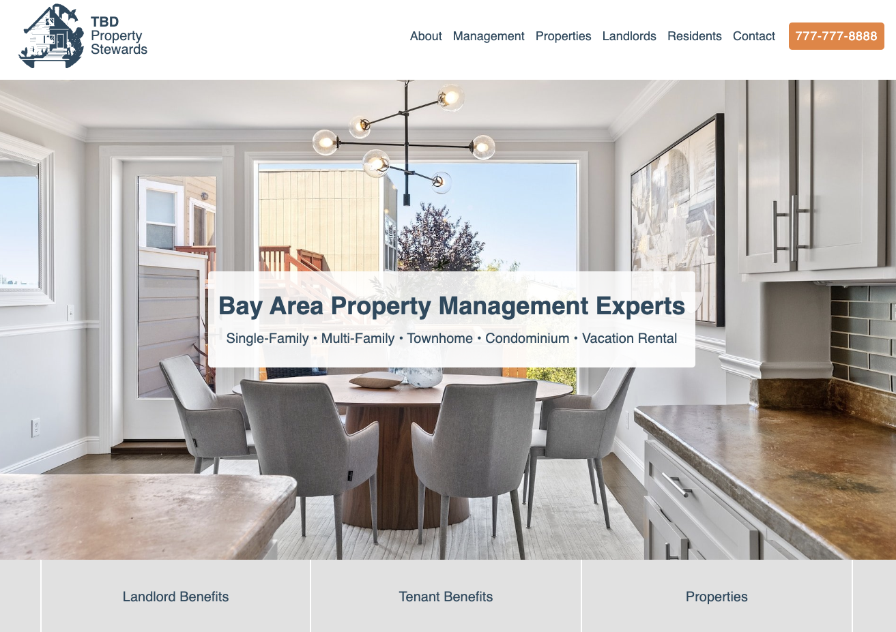

# Property Management Business Website

## Overview

A custom coded static business website. Current site contains only a landing page with general info or filler content and design outline. Content needs to be added and updated before website goes live.

[Live Demo](https://meek-biscochitos-0bbd83.netlify.app)

## Future Work - Immediate Attention

- Add mobile, tablet, and large screen versions (add media breakpoints).
- Edit and consolidate styles.
- Add name for business.
- Update content.
- Add secondary pages and fix page links.

## Future Work - Nice To Haves

- Create tenant / owner portals.
- Add image carousel for hero banner showing different images.
- Add light / dark mode.
